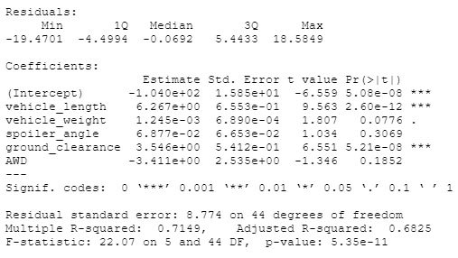
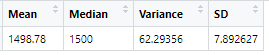
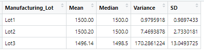
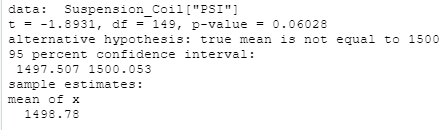
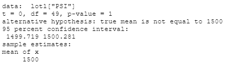
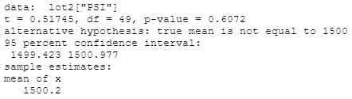
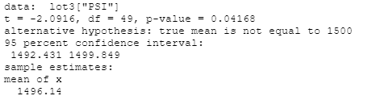

# MechaCar Statistical Analysis

## Linear Regression to Predict MPG

- Which variables/coefficients provided a non-random amount of variance to the mpg values in the dataset?
	- Vehicle Length and Ground Clearance contribute the least amount of variance to the mpg values.

- Is the slope of the linear model considered to be zero? Why or why not?
	- The slope is considered non-zero because the p-value of our linear regression analysis is 5.35e-11 which is much smaller than the significance level of 0.05%. 

- Does this linear model predict mpg of MechaCar prototypes effectively? Why or why not?
	- The calculated multiple r-squared value is 0.7149 which means that roughly 71% of the variability of our dependent value is explained using this linear model. This does not necessarily mean this is a good predicator.

## Summary Statistics on Suspension Coils

The Suspension_Coil dataset contained results from multiple manufacturing production lots. We created two dataframes:
1. Total Summary: the mean, median, variance and standard deviation of the suspension coil's PSI (pounds per square inch) column

2. Lot Summary: the mean, median, variance, and standard deviation of the suspension coil's PSI (pounds per square inch) column grouped by each manufacturing lot

- The design specifications for the MechaCar suspension coils dictate that the variance of the suspension coils must not exceed 100 pounds per square inch. Does the current manufacturing data meet this design specification for all manufacturing lots in total and each lot individually? Why or why not?

	- The variance of the Total Summary is 62.29356 and is below 100 pounds per square inch, meaning the data does meet design specifications.
	- Lot 1 (variance: 0.9795918) and Lot 2 (variance: 7.4693878) individually both meet the design specifications.
	- Lot 3 (variance: 170.2861224) exceeds 100 pounds per square inch so it does not meet the design specifications.

## T-Tests on Suspension Coils

#### All Manufacturing Lots T-Test

#### Lot 1 T-Test

#### Lot 2 T-Test

#### Lot 3 T-Test

- Briefly summarize your interpretation and findings for the t-test results. Include screenshots of the t-test to support your summary.
	- Assuming our significance level was the common 0.05%, our p-vaues for all manufacturing lots combined, lot 1 individually, and lot 2 individually are above our significance level. This means we do not have sufficient evidence to reject the null hypothesis.
	- Lot 3 t-test has a p-value of 0.4168, which is below the significance level of 0.05, so we can reject the null hypothesis. 

## Study Design: MechaCar vs Competition

Write a short description of a statistical study that can quantify how the MechaCar performs against the competition. In your study design, think critically about what metrics would be of interest to a consumer: for a few examples, cost, city or highway fuel efficiency, horse power, maintenance cost, or safety rating.

What metric or metrics are you going to test?

What is the null hypothesis or alternative hypothesis?

What statistical test would you use to test the hypothesis? And why?

What data is needed to run the statistical test?